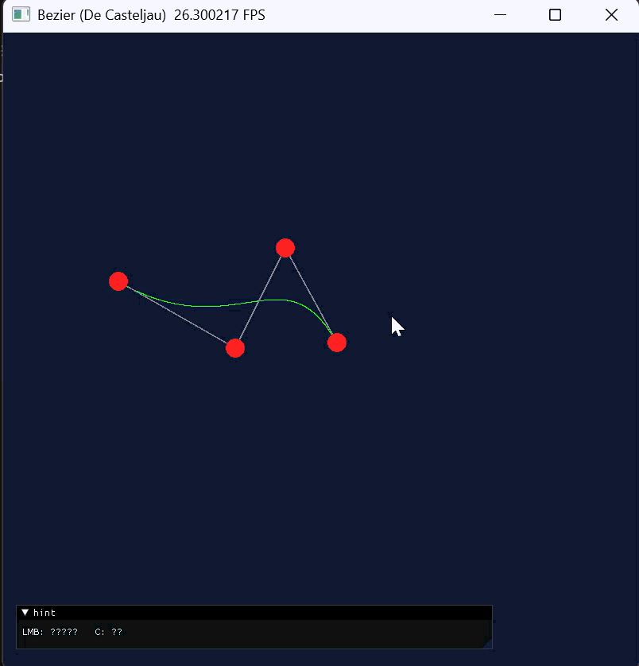

# Work3：贝塞尔曲线（De Casteljau + 光栅化）

本实验在 **Python + Taichi** 环境下实现：用 **De Casteljau 算法**在 CPU 上计算贝塞尔曲线上的采样点，再一次性传入 GPU，通过 **并行内核**将结果**光栅化**到帧缓冲（`pixels`），并用 **GGUI** 完成鼠标加点与键盘清空等交互。

## 实验目标

- 理解贝塞尔曲线的几何意义及参数 \(t \in [0,1]\) 的含义。
- 用代码实现 **De Casteljau**（迭代线性插值，避免递归深度问题）。
- 理解光栅化：将归一化坐标 \([0,1]^2\) 映射到离散像素索引，并写入颜色。
- 熟悉 Taichi 的 `Field`、`@ti.kernel`、以及 **GGUI**（`ti.ui.Window` / `Canvas`）事件与绘制顺序。

## 原理简述

### De Casteljau

给定控制点 \(P_0,\ldots,P_{n-1}\) 与参数 \(t\)，反复对相邻点做凸组合  
\(P'_i=(1-t)P_i+tP_{i+1}\)，直到只剩一点，即为该 \(t\) 处曲线上的点。  
本程序在 **CPU** 上对 \(t = i/1000,\; i=0\ldots1000\) 共 **1001** 个采样点调用 `de_casteljau`，得到整条折线逼近的曲线。

### 光栅化与 GPU 并行

- 帧缓冲 `pixels` 为 **800×800** 的 `ti.Vector(3)`，表示 RGB。
- 内核 `draw_curve_kernel(n)` 中并行执行 `for i in range(n)`：读取 `curve_points_field[i]` 的归一化坐标，乘以宽高并转为 `int`，在 **边界检查** `0 <= x < W` 且 `0 <= y < H` 后将该像素置为绿色。
- **不要在 Python 循环里逐点写 GPU Field**（频繁 CPU↔GPU 传输会极卡）；应 **批量** `from_numpy` 再调用一次 kernel。

### GGUI 绘制顺序

- 先 `canvas.set_image(pixels)` 显示光栅结果，再绘制 **灰色控制多边形**（`canvas.lines`）和 **红色控制点**（`canvas.circles`）。  
- `canvas.circles` 的 `radius` 与 `lines` 的 `width` 为**相对屏高**的比例（约 `0.01` 量级），**不是像素**，否则圆会过大铺满屏幕。

## 目录与文件说明

| 文件 | 说明 |
|------|------|
| [`main.py`](main.py) | 主程序：初始化、De Casteljau 采样、`draw_curve_kernel`、交互主循环 |
| [`gen_gif.py`](gen_gif.py) | 离线生成演示 GIF（无需显示窗口），默认带箭头光标轨迹 |
| [`run_bezier.bat`](run_bezier.bat) | Windows 下双击运行（优先使用仓库内 `work2\.venv` 的 Python） |
| [`screen_record_2026-04-02.gif`](screen_record_2026-04-02.gif) | 本地运行交互录屏（原文件名：屏幕录制 2026-04-02 190535.gif，入库时重命名） |

## 环境依赖

- Python **3.10+**（推荐 3.12）
- 依赖包：`taichi`、`numpy`

```bash
pip install taichi numpy
```

## 运行方式

在 `work3` 目录下：

```bash
python main.py
```

或在本仓库根目录执行：

```bash
python work3/main.py
```

Windows 下也可双击 [`run_bezier.bat`](run_bezier.bat)（若已配置 `work2\.venv`）。

## 操作说明

| 输入 | 作用 |
|------|------|
| **鼠标左键** | 在画布上添加控制点（最多 100 个）；归一化坐标 \([0,1]^2\) |
| **键盘 C** | 清空所有控制点并重置画面 |

当控制点 **不少于 2 个** 时，会绘制灰色**控制多边形**、绿色**贝塞尔曲线**（由 1001 个采样点光栅化）以及红色**控制点**。

## 离线动图（无窗口）

不依赖 Taichi 窗口，用 Pillow 离线渲染：

```bash
python gen_gif.py --frames 72 --out bezier_cursor.gif
```

默认生成带箭头光标、沿曲线移动的 `bezier_cursor.gif`（可用参数调整帧数与输出文件名）。

## 演示录屏

以下为本地运行 `main.py` 时的交互录屏（原文件：屏幕录制 2026-04-02 190535.gif，已重命名为仓库内文件名以便引用）：



## 仓库链接

本作业位于课程仓库：[GitHub - 2024zhaoyujie/CG_LAB](https://github.com/2024zhaoyujie/CG_LAB)  

**Work3 目录**：[github.com/2024zhaoyujie/CG_LAB/tree/main/work3](https://github.com/2024zhaoyujie/CG_LAB/tree/main/work3)
