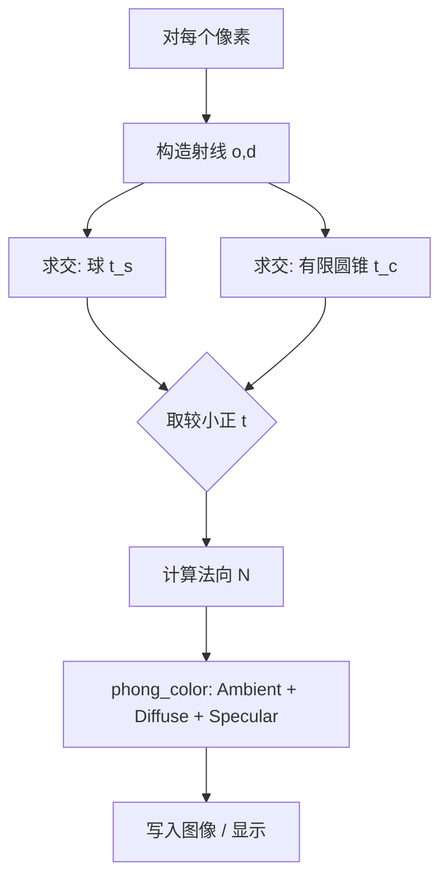

<h1 align="center">Phong 局部光照与光线投射（Taichi）</h1>

<p align="center">
  <b>计算机图形学 · 实验报告</b><br/>
  <a href="https://zhanghongwen.cn/cg">课程主页 zhanghongwen.cn/cg</a>
</p>

<p align="center">
  
</p>

---

## 概览

| 项目 | 内容 |
|------|------|
| **实验** | Phong 模型：环境光 + Lambert 漫反射 + Phong 高光；光线投射求交 |
| **代码** | `phong_raytracing.py` |
| **依赖** | `pyproject.toml` + `uv`；核心库 `taichi`、`matplotlib` |
| **演示** | 上图或同目录 [`demo.gif`](demo.gif) |


---

## 一、实验目的

| 维度 | 目标 |
|------|------|
| **理论** | 理解三项光照的物理含义及线性叠加得到表面颜色 |
| **数学** | 向量归一化、点积、反射方向、法向量与「最近交点」遮挡 |
| **工程** | Taichi 逐像素 Kernel；滑块实时调节 **Ka、Kd、Ks、Shininess（n）** |

---

## 二、Phong 模型（对照表）

总光强：**环境 + 漫反射 + 镜面**。

| 分量 | 作用（直觉） | 计算式（伪代码，RGB 按分量运算） |
|------|--------------|----------------------------------|
| **环境光** | 均匀底光，抬升整体亮度 | `I_amb = Ka * C_light * C_object` |
| **漫反射** | 随入射角变化，背光为 0 | `I_diff = Kd * max(0, dot(N,L)) * C_light * C_object` |
| **镜面** | 高光斑点，指数 n 控制尖锐程度 | `I_spec = Ks * max(0, dot(R,V))^n * C_light` |

**向量约定：** `N`、`L`、`V` 均为单位向量；`L` 指向光源，`V` 指向相机。反射方向：

`R = normalize( 2*dot(N,L)*N - L )`

**实现注意：** 对 `dot(N,L)`、`dot(R,V)` 做非负截断；RGB **clamp 到 [0,1]**；若 `dot(N,V) < 0` 则翻转 `N`，减轻背面错误光照。

---

## 三、渲染管线（示意）



---

## 四、场景参数（与代码一致）

| 对象 | 参数 |
|------|------|
| 相机 | (0, 0, 5) |
| 点光源 | (2, 3, 4)，白光 (1,1,1) |
| 背景 | RGB ≈ (0.02, 0.12, 0.15) |
| 红球 | 半径 0.5，球心 ≈ (−0.45, −0.05, 0)，`SPHERE_*` |
| 紫圆锥 | 顶点 ≈ (0.45, 0.55, 0)；底面 **y = −0.55**，`CONE_BASE_Y`；底半径 0.5，`CONE_R_BASE` |
| 锥斜率 | `CONE_K = CONE_R_BASE / CONE_H`（侧壁二次方程 + 高度裁剪） |

---

## 五、实现要点（摘要）

1. **光线：** 像素 → 视平面点 `target`（z=0），`d = normalize(target - o)`，`o` 为相机。  
2. **求交：** 球用二次方程最小正根；锥为有限锥（侧面 + 底圆盘），`try_cone_t` 限制在锥段内。  
3. **深度：** 对 `t_s`、`t_c` 取更小正根，等价最近表面 / Z-buffer 思想。  
4. **法向：** 球 `normalize(P-C)`；锥为梯度或底面 (0,−1,0)。  
5. **着色：** `phong_color` 内合成三项，`min(max(col,0),1)` 输出。

---

## 六、交互与双前端

| 滑块 | 范围 | 默认 | 含义 |
|------|------|------|------|
| Ka | 0.0～1.0 | 0.2 | 环境光 |
| Kd | 0.0～1.0 | 0.7 | 漫反射 |
| Ks | 0.0～1.0 | 0.5 | 镜面 |
| Shininess | 1.0～128.0 | 32 | 高光指数 n |

- **中文路径：** 默认 **Matplotlib + Slider**，并写 `phong_preview.png`。  
- **纯英文路径：** 可尝试 `ti.ui`；或环境变量 **`PHONG_FORCE_TAICHI_UI=1`** 强制 Taichi 窗口。  
- **后端：** 默认 CPU；可设 `TI_ARCH=vulkan` / `cuda`（见源码注释）。

---

## 七、运行

```bash
cd work4   # 在仓库根目录时进入本目录
uv sync
uv run python phong_raytracing.py
```

Windows 也可双击 **`run_phong.bat`**。

---

## 八、调参现象（简要）

| 操作 | 视觉效果 |
|------|----------|
| Ka ↑ | 整体变亮，暗部也抬升 |
| Kd ↑ | 明暗对比增强（随 N·L） |
| Ks ↑ | 高光更亮 |
| Shininess ↑ | 高光更尖、更窄 |

---

## 九、总结

本实验在 Taichi 上完成了「光线投射 → 球与有限圆锥求交 → 最近表面 → Phong 着色 → 滑块调参」的闭环；针对 **Windows + 中文路径** 下 GGUI 易失败的问题，提供 **Matplotlib 备用界面**，保证可复现、可展示。后续可扩展 Blinn-Phong、硬阴影等。

---

## 附录 · 文件

| 文件 | 说明 |
|------|------|
| `phong_raytracing.py` | 主程序 |
| `pyproject.toml` | 依赖与 Python 版本 |
| `run_phong.bat` | 一键运行 |
| `demo.gif` | 演示动画 |
| `phong_preview.png` | Matplotlib 首次运行可能生成的预览帧 |
