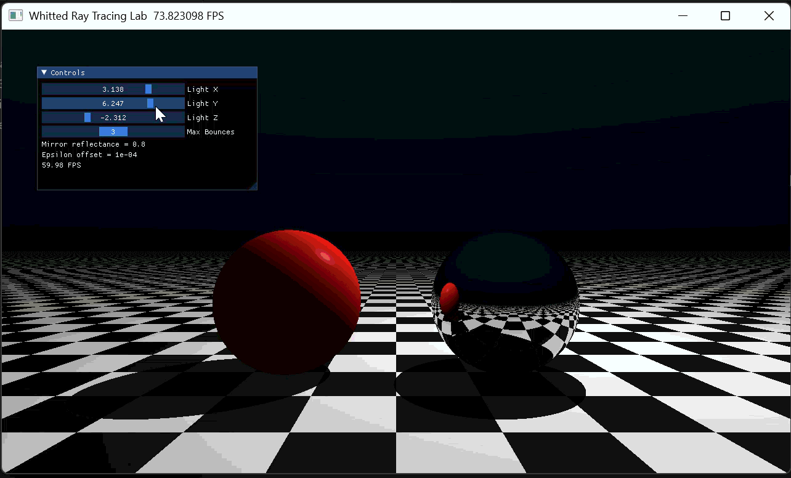

# 计算机图形学实验五报告：光线追踪（Whitted Style）

## 一、实验信息
- 课程：计算机图形学
- 实验名称：光线追踪
- 授课教师：张鸿文
- 助教：张怡冉
- 课程主页：[https://zhanghongwen.cn/cg](https://zhanghongwen.cn/cg)

## 二、实验目标
- 理解 Ray Casting 与 Ray Tracing 的区别。
- 掌握次级射线在硬阴影与镜面反射中的作用。
- 将递归光追改写为适合 GPU 的迭代弹射模式。
- 完成选做：玻璃折射（含全反射）与 MSAA 抗锯齿。

## 三、实验环境
- 操作系统：Windows 11
- 语言：Python 3.12
- 主要库：Taichi 1.7.4
- 渲染后端：Vulkan（无 CUDA 时自动回退）

## 四、核心实现
### 1. 场景与材质系统
场景由三个隐式几何体组成：
- 地面平面 `y = -1.0`，法线 `(0, 1, 0)`，漫反射棋盘格。
- 左侧球体：玻璃材质（由原红色漫反射球改为选做玻璃球）。
- 右侧球体：理想镜面球。

材质 ID 设计：
- `0`: MISS
- `1`: GROUND_DIFFUSE
- `2`: GLASS
- `3`: MIRROR

### 2. 迭代光线弹射（替代递归）
每个像素内维护：
- `throughput`（吞吐量，初值 1）
- `sample_color/final_color`（颜色累积）

在 `for bounce in range(MAX_BOUNCES_LIMIT)` 中进行追踪：
- 未命中物体：累加背景色后结束该样本。
- 命中镜面：按反射定律更新方向并衰减吞吐量。
- 命中玻璃：按斯涅尔定律计算折射方向，并结合菲涅耳项在反射/折射间选择。
- 命中漫反射地面：执行 Phong 光照并结束该样本。

### 3. 硬阴影与精度修复
对于漫反射着色点，向光源发射 shadow ray：
- 若光源前有遮挡，仅保留环境光。
- 若无遮挡，叠加漫反射和高光。

为避免自相交（Shadow Acne），所有次级射线都采用：
- `P_new = P + N * epsilon`（或按出射方向调整偏移符号）

### 4. 选做一：折射与玻璃材质
- 引入折射率 `GLASS_IOR = 1.5`。
- 使用斯涅尔定律计算折射方向。
- 当 `k < 0` 时判定为全反射，自动走反射路径。
- 采用 Schlick 近似计算菲涅耳反射概率，提高玻璃边缘真实感。

### 5. 选做二：MSAA 抗锯齿
- 每像素进行多次主射线采样（`MSAA Samples`）。
- 每次采样在像素内加入随机抖动（jitter）。
- 对多次采样结果取平均，显著平滑物体边缘锯齿。

## 五、交互功能
通过 `ti.ui.Window` 提供实时滑块：
- `Light X / Light Y / Light Z`：动态调整点光源位置。
- `Max Bounces`：控制最大弹射次数（1~5）。
- `MSAA Samples`：控制每像素采样数（1~8）。

## 六、结果展示
### 第一次演示动图

### 第二次演示动图

## 七、结果分析
- 当 `Max Bounces = 1` 时，次级反射路径短，镜面球内部信息较少。
- 当 `Max Bounces > 1` 时，镜面和玻璃球中可观察到更丰富的间接反射/折射效果。
- 增大 `MSAA Samples` 可降低边缘锯齿，但会降低实时帧率。
- 引入 epsilon 偏移后，成功避免大面积黑点与阴影噪声问题。

## 八、总结
本实验完成了 Whitted 风格光线追踪的完整流程，实现了主光线、阴影射线、镜面反射射线和玻璃折射射线的统一迭代追踪；在此基础上加入 MSAA 抗锯齿，提升了图像质量。实验结果满足基础要求，并完成两个选做内容。
