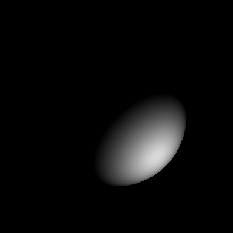
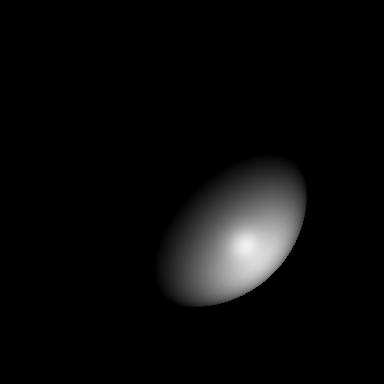
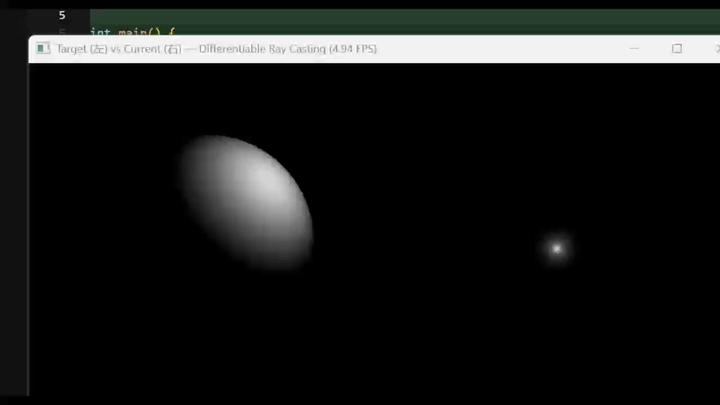

# 可微渲染（Differentiable Ray Casting）实验报告

**姓名**：赵雨洁 
**学号**：202411081030
**日期**：2026 年 5 月  

---

## 一、实验目的

1. 理解可微渲染的基本思想：**渲染图 → 误差 → 反向传播 → 更新场景参数** 的闭环。  
2. 掌握基于 Taichi 的**正向光线投射**（ray casting）与球求交、法线、光照计算。  
3. 使用 **`ti.ad.Tape`** 自动求导与 **Adam** 优化器，反传优化**光源位置**等参数。  
4. 认识标准 \(\max(0, \mathbf{n}\cdot\mathbf{l})\) 在背光区域梯度消失的问题，采用 **Leaky Lambertian** 保证梯度可跨出“全暗区”。  
5. **（选做）** 联合优化**漫反射颜色**；将光照升级为 **Blinn–Phong** 并优化 **shininess**。

---

## 二、实验原理

### 2.1 正向渲染

对屏幕每个像素发射与 **+Z** 平行的射线，与半径 \(r=0.3\)、中心 \((0.5,0.5,0.5)\) 的球求最近交点，计算法线 \(\mathbf{n}\)，光源方向 \(\mathbf{l}\)，得到灰度强度写入图像。

### 2.2 Leaky Lambertian

采用泄漏漫反射，避免 \(\mathbf{n}\cdot\mathbf{l}\le 0\) 时被硬截断导致梯度为 0：

\[
I = \max\left(\alpha\,(\mathbf{n}\cdot\mathbf{l}),\ \mathbf{n}\cdot\mathbf{l}\right),\quad \alpha=0.1
\]

损失函数为渲染图与目标图的 **MSE**；实现上与 Tape 兼容时，将像素误差与（选做时的）正则项写入同一前向核，满足反向模式对并行结构的要求。

### 2.3 优化

使用 **`ti.ad.Tape(loss)`** 记录计算图，对可微参数反向传播；参数更新采用 **Adam**（动量与二阶矩校正）。**（选做）** 漫反射颜色对三色可引入对目标灰 \((0.85,0.85,0.85)\) 的正则项，使标量成像下 RGB 仍收敛到一致灰度。

### 2.4 Blinn–Phong（选做）

在 Leaky 漫反射基础上增加镜面项：半角向量 \(\mathbf{h}\)，\(n_h=\max(\mathbf{n}\cdot\mathbf{h},0)\)，镜面与 \(\mathbf{n}\cdot\mathbf{l}\) 的泄漏门控结合以保持可微性；**shininess** 作为可微标量与光源等一并优化。

---

## 三、实验环境

| 项目 | 说明 |
|------|------|
| 系统 | Windows 10/11 |
| Python | 3.12（项目 `.venv`） |
| Taichi | 1.7.4，默认 **CPU（x64）** |
| 主要依赖 | `taichi`，`numpy`，`Pillow` |

**程序入口**：本目录 **`differentiable_raycasting_adam.py`**（依赖见 `requirements.txt`，可用 `pip install -r requirements.txt`）。

说明：中文路径下建议默认 **CPU**；若英文路径且驱动正常，可通过环境变量 `TI_ARCH=cuda` 等尝试 GPU。

---

## 四、实验内容与运行方式

### 4.1 必做内容摘要

| 项目 | 设定 |
|------|------|
| 球体 | 半径 0.3，中心 (0.5, 0.5, 0.5) |
| 目标光源 | (0.8, 0.8, 0.2)，用于生成 Ground Truth |
| 初始光源 | (0.2, 0.2, 0.8)（偏背面） |
| 输出 | 必做模式默认保存 `target_render.png` |

**命令示例**：

```bash
python differentiable_raycasting_adam.py              # 带 GUI，左右对比
python differentiable_raycasting_adam.py --no-gui        # 仅终端与优化，跑满默认迭代
```

### 4.2 选做部分（三张目标渲染图说明与插图）

选做对应三种模式，脚本会生成不同的 **GT 灰度 PNG**（均为目标光源 + 固定灰物体色下的“标准答案图”），便于报告对照。

> **说明**：选做①在**仅联合颜色**时，Ground Truth 的成像模型与必做一致（Leaky Lambert + 灰球），因此 **`target_gt_joint_color.png` 与 `target_render.png` 在视觉与文件尺寸上可一致**；差异体现在**优化变量**（多一个可微 albedo）。选做②、选做①+② 使用 **Blinn–Phong**，图上可见**高光斑**。

#### 选做① 联合优化光源与漫反射颜色

错误初值颜色在代码中设定，优化后向灰度 \((0.85,0.85,0.85)\) 与目标光源收敛。

```bash
python differentiable_raycasting_adam.py --joint-color --no-gui
```



#### 选做② Blinn–Phong + shininess 可微

以错误 **shininess** 初值与背面光源开局，向 GT（ shininess=32 ）与目标光优化。

```bash
python differentiable_raycasting_adam.py --blinn-phong --no-gui
```



#### 选做① + 选做② 同时开启

```bash
python differentiable_raycasting_adam.py --extras --no-gui
```


---

## 五、过程可视化（GUI 录屏）

以下为实验程序 **`ti.GUI`** 运行时录制的动图：左侧为 **Target（目标图）**，右侧为 **Current（当前渲染）**，可观察优化过程中右侧图像随迭代逐步贴近左侧。（与本报告同目录的 `converted_gui_demo.gif`；原始录屏路径见本节末尾脚注。）



---

## 六、实验现象与结果分析

1. **初期**：光源位于球体偏背面时，在 Leaky 模型下仍有非零梯度，`loss` 可缓慢下降，光源位置沿可微方向“绕到”受光侧；当光越过临界方位后，**MSE 常出现更快下降**。 
2. **Adam**：相对 SGD 更易平滑轨迹，在目标光源附近可能出现**轻微超调**再收回。  
3. **选做**：联合颜色时三色在正则下收敛到目标灰；Phong 模式下 **shininess** 从错误初值向 **32** 爬升需要足够迭代（脚本默认 **`ITERS=1400`**，可用 `--iters` 加大）。  

---

## 七、问题与总结

1. Taichi **可微程序**需注意并行核与 `Tape` 搭配时的结构限制。  
2. **GUI** 关闭窗口会结束循环属正常行为；完整跑步数可使用 **`--no-gui`**。  
3. 选做中仅用标量灰度图像时，漫反射 RGB 存在多解，**对灰的正则**有助于三色与实验目标一致。  

---

## 参考文献与材料

1. Taichi 文档：Differentiable Programming（可微编程）。  
2. 课程/实验手册：可微渲染与光线投射实验说明。  
3. **动图来源脚注**：用户提供录屏 `converted.gif`，已复制到本目录 **`converted_gui_demo.gif`** 以便与报告一并归档；原始路径为  
   `D:\xwechat_files\wxid_0726pcvkytu922_55f2\msg\file\2026-05\gif\gif\converted.gif`。

---

**附录：与本报告同目录的图片文件**

| 文件名 | 用途 |
|--------|------|
| `converted_gui_demo.gif` | GUI 过程录屏（插入第五章） |
| `target_gt_joint_color.png` | 选做① GT |
| `target_gt_blinn_phong.png` | 选做② GT |
| `target_gt_optional_full.png` | 选做①+② GT |
| `target_render.png` | 必做 GT（可与选做①对照） |
| `requirements.txt` | Python 依赖 |
| `README.md` | **实验报告**（本目录说明文档） |

本目录对应课程仓库 [CG_LAB/work6](https://github.com/2024zhaoyujie/CG_LAB/tree/main/work6)。
