# 实验报告：PyTorch3D 可微渲染网格重建（Work6_2）

## 1. 实验目标

本实验围绕“可微渲染 + 网格形变优化”展开，目标如下：

1. 理解软光栅化在离散几何边界上的梯度近似机制。
2. 掌握利用多视角二维监督（Silhouette / RGB）反推三维网格的方法。
3. 理解网格正则化对优化稳定性和几何合理性的核心作用。
4. 在基础任务上完成选做任务：联合 RGB 监督优化几何与颜色。

## 2. 理论基础

### 2.1 软光栅化与可导边界

传统硬光栅化中，像素归属是离散 0/1，边界处不可导，梯度容易消失。软光栅化通过连续概率近似像素覆盖关系：

$$A(d)=\sigma\left(\frac{d}{\sigma_r}\right)$$

其中，$d$ 为像素到三角形边缘的符号距离，$\sigma_r$ 控制边缘平滑程度。该机制保证了边界附近也能接收到稳定梯度，从而驱动顶点向正确方向更新。

### 2.2 网格正则化

如果仅优化图像重建误差，网格常出现尖刺、过度拉伸、局部翻折等现象。为提升几何质量，本实验在数据项之外引入三类正则项：

- 拉普拉斯平滑：抑制局部高频噪声；
- 边长约束：限制边长异常变化；
- 法线一致性：维持相邻面片法线连续。

联合损失定义为：

$$L_{total}=L_{silhouette}+w_{rgb}L_{rgb}+w_{lap}L_{lap}+w_{edge}L_{edge}+w_{normal}L_{normal}$$

其中基础任务使用 `w_rgb = 0`，选做任务启用 `L_rgb`。

## 3. 实现设计

### 3.1 代码组织

- `src/Work6/config.py`：分组配置（渲染/训练/损失）；
- `src/Work6/data.py`：目标网格加载、归一化、相机采样；
- `src/Work6/renderers.py`：SoftSilhouette 和 SoftPhong 渲染器；
- `src/Work6/losses.py`：数据项与正则项损失；
- `src/Work6/train_silhouette.py`：基础任务训练；
- `src/Work6/train_textured.py`：选做任务训练；
- `src/Work6/visualize.py`：图片、曲线、mesh、日志导出；
- `src/Work6/main.py`：统一命令入口。

### 3.2 关键流程

1. 渲染目标奶牛网格的多视角监督图像；
2. 以高细分球体作为可变形源网格；
3. 优化顶点位移（基础）或顶点位移 + 顶点颜色（选做）；
4. 定期保存中间结果、最终网格和损失曲线。

### 3.3 与模板实现的差异化

1. 统一子命令入口，训练流程更集中；
2. 使用 dataclass 分层配置，便于系统调参；
3. 输出目录规范化，附带 `metrics.json` 记录；
4. 不同任务使用不同默认学习率和种子。

## 4. 实验环境与参数

### 4.1 运行环境

- 平台：Google Colab（GPU）
- 依赖：`work6_2/requirements_colab.txt`

安装命令：

```bash
pip install -U pip
pip install -r work6_2/requirements_colab.txt
```

### 4.2 实验命令

```bash
# 基础任务（Silhouette）
python -m src.Work6.main silhouette --steps 220 --image-size 224 --num-views 18 --seed 2026

# 选做任务（Textured）
python -m src.Work6.main textured --steps 240 --image-size 224 --num-views 20 --seed 2027
```

### 4.3 主要参数解释

- `steps`：迭代步数，决定收敛程度与耗时；
- `image-size`：渲染分辨率，越高越精细但显存开销更大；
- `num-views`：监督视角数，多视角通常带来更稳健几何；
- `w_lap / w_edge / w_normal`：正则项权重，控制平滑与细节平衡；
- `w_rgb`：RGB 拟合权重，仅在选做任务启用。

## 5. 实验结果与分析

### 5.1 基础任务：Silhouette 拟合

- 输出目录：`outputs/work6/silhouette_20260512_183955`
- 最终指标：`final_total=0.014295`，`final_silhouette=0.001479`

结果展示：

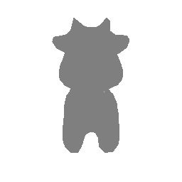

*图 1：Silhouette 任务最终 turntable 动图。*

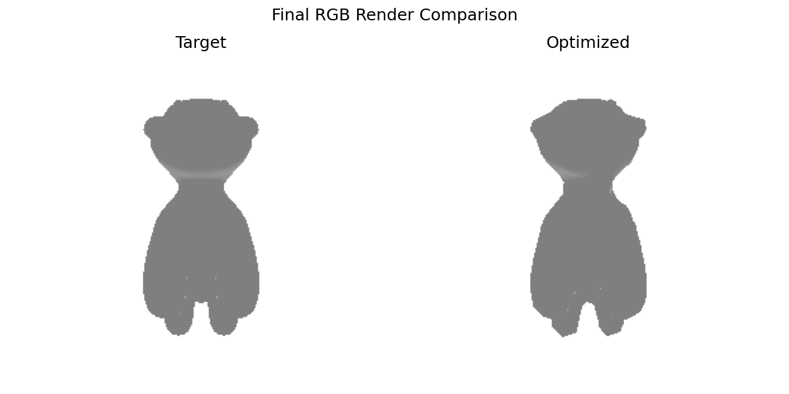

*图 2：最终重建结果与参考渲染对比。*


*图 3：Silhouette 训练损失曲线，整体稳定下降。*

中间过程：

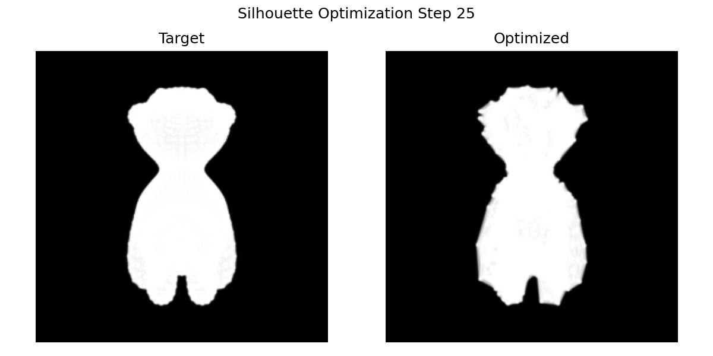
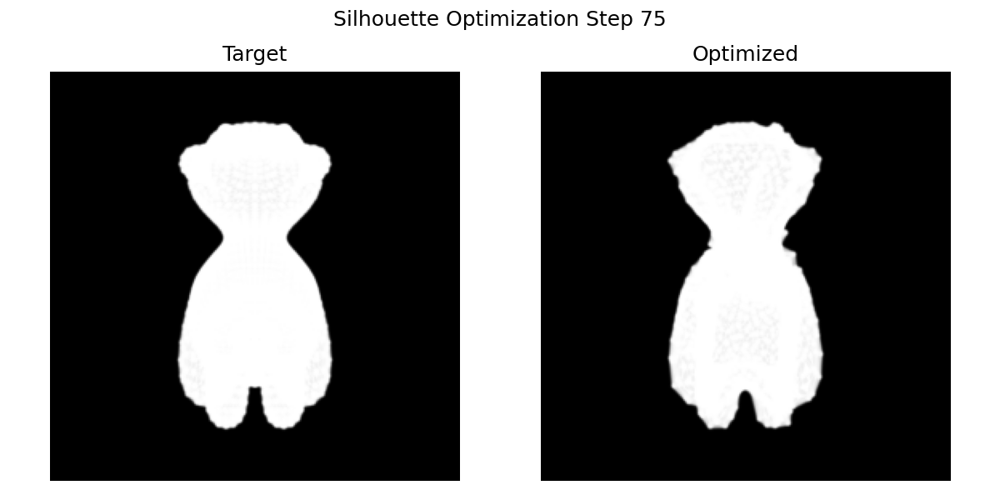
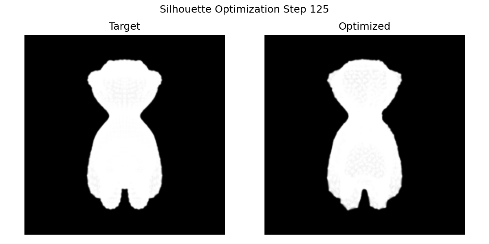
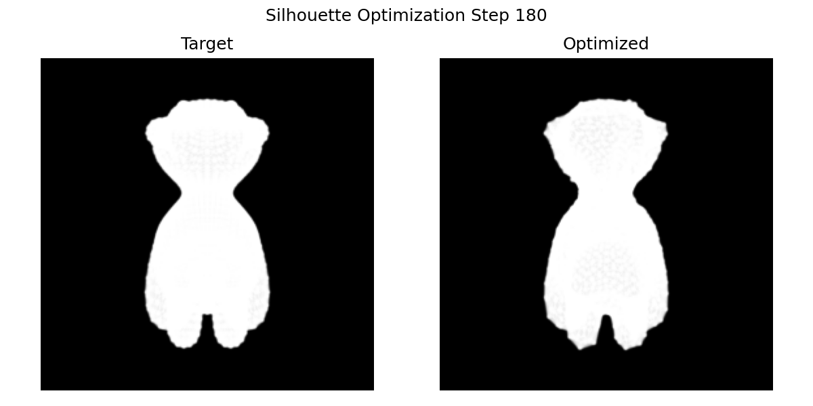

*图 4：从球体逐步形变到目标轮廓。*

分析：基础任务中轮廓损失显著下降，几何外形已能稳定逼近目标模型，说明软光栅化梯度与正则项配合有效。

### 5.2 选做任务：Textured 联合优化

- 输出目录：`outputs/work6/textured_20260512_183217`
- 最终指标：`final_total=0.012874`，`final_silhouette=0.000996`，`final_rgb=0.001962`

结果展示：

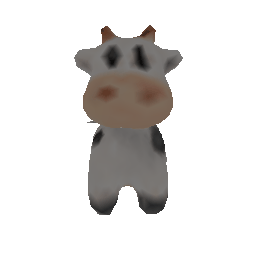

*图 5：Textured 任务最终 turntable 动图。*

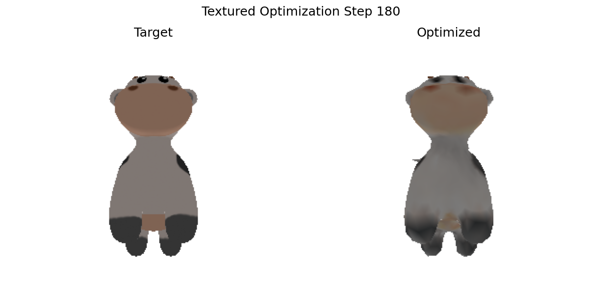

*图 6：RGB 联合优化后的阶段性渲染结果。*


*图 7：联合优化损失曲线，silhouette 与 rgb 均逐步收敛。*

中间过程：

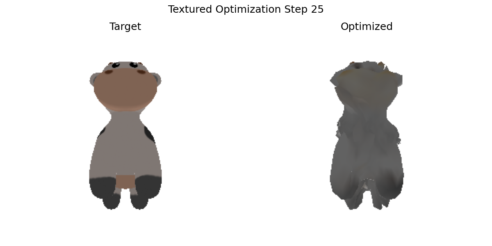
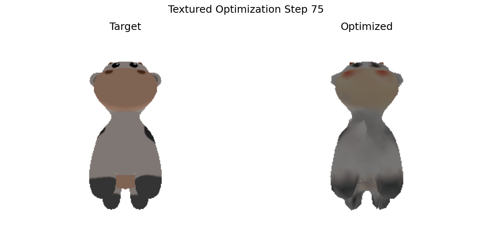
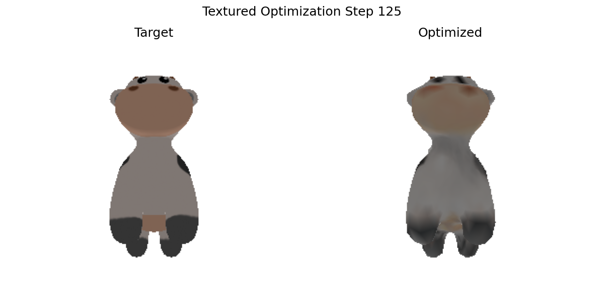
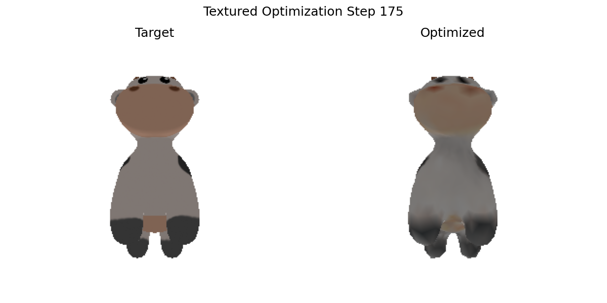

*图 8：颜色与几何联合收敛过程。*

分析：在保持轮廓精度的同时，RGB 误差持续下降，表明几何与外观协同优化有效；但该阶段训练耗时与显存开销明显上升。

## 6. 调参与问题排查

1. `ModuleNotFoundError: pytorch3d`  
   原因：运行环境依赖缺失。  
   处理：使用 Colab + 指定依赖文件，避免本地复杂 CUDA 编译。

2. 训练早期出现过度形变  
   原因：学习率偏大或正则权重不足。  
   处理：降低学习率并提高 `w_lap`、`w_edge`。

3. 颜色收敛波动  
   原因：RGB 监督梯度更敏感。  
   处理：将 `w_rgb` 调整到更平衡区间，增加中间可视化检查频率。

## 7. 实验结论

1. 软光栅化解决了边界梯度不可导问题，是 mesh-from-image 的关键基础；
2. 正则项不仅提升视觉质量，也是避免优化崩坏的必要条件；
3. RGB 联合监督可提升外观一致性，但需要更细致的权重与资源预算；
4. 多视角监督和规范化输出流程有助于复现实验与结果对比。

## 8. 提交清单

- 代码：`src/Work6/*`
- 依赖：`requirements_colab.txt`
- 运行脚本：`run_colab.sh`
- 结果：`outputs/work6/silhouette_20260512_183955`、`outputs/work6/textured_20260512_183217`
- 报告：本 `README.md`
